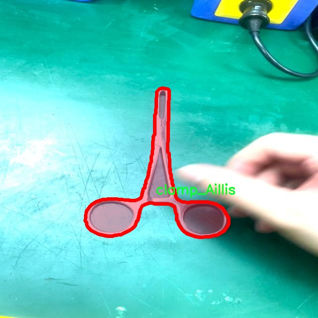
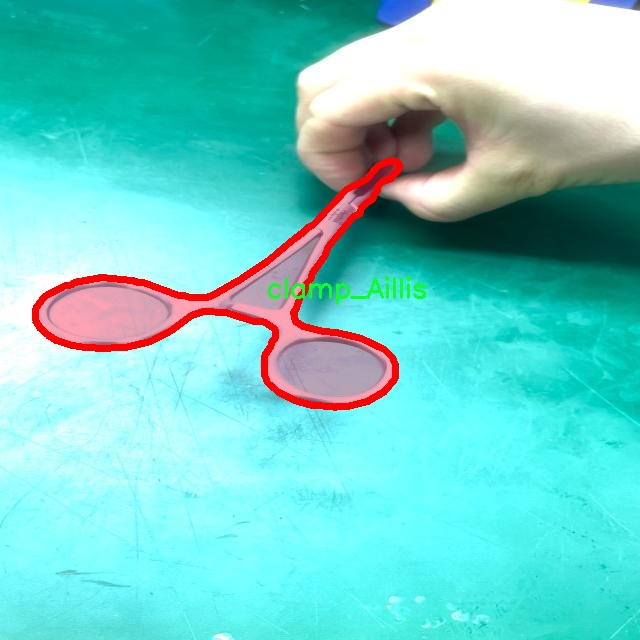

# 外科手术工具分割系统源码＆数据集分享
 [yolov8-seg-slimneck＆yolov8-seg-attention等50+全套改进创新点发刊_一键训练教程_Web前端展示]

### 1.研究背景与意义

项目参考[ILSVRC ImageNet Large Scale Visual Recognition Challenge](https://gitee.com/YOLOv8_YOLOv11_Segmentation_Studio/projects)

项目来源[AAAI Global Al lnnovation Contest](https://kdocs.cn/l/cszuIiCKVNis)

研究背景与意义

随着医学技术的不断进步，外科手术的复杂性和精确性要求也日益提高。在外科手术中，手术工具的准确识别与分割对于提高手术的安全性和效率至关重要。传统的手术工具识别方法往往依赖于人工标注和经验判断，容易受到人为因素的影响，导致识别精度低、效率差。因此，开发一种基于深度学习的自动化手术工具分割系统，能够有效提升手术过程中的工具识别能力，成为当前医学影像处理领域的重要研究方向。

近年来，YOLO（You Only Look Once）系列模型因其优越的实时检测性能而广泛应用于目标检测和分割任务。YOLOv8作为该系列的最新版本，结合了多种先进的深度学习技术，具有更高的检测精度和更快的处理速度。通过对YOLOv8进行改进，针对外科手术工具的特定需求进行优化，可以有效提升其在手术场景中的应用效果。尤其是在手术过程中，快速、准确地识别和分割不同类型的手术工具，能够为外科医生提供实时的视觉辅助，减少手术失误，提高患者的安全性。

本研究所使用的数据集“surgical_tool_segmentation_mj”包含4100张图像，涵盖15种不同类别的外科手术工具，包括各种夹钳、镊子、针持器、切割器等。这些工具在手术中发挥着不可或缺的作用，准确的分割和识别能够帮助医生更好地进行操作，减少手术时间和并发症的发生。此外，数据集的多样性和丰富性为模型的训练提供了良好的基础，使得模型能够在不同的手术场景中具备较强的泛化能力。

通过对YOLOv8的改进，我们将探索其在外科手术工具分割中的应用潜力，研究如何通过优化网络结构、调整损失函数和增强数据集等方式，提高模型的分割精度和实时性。此项研究不仅具有重要的理论意义，也为实际手术提供了切实可行的技术支持。通过实现高效的外科手术工具分割系统，我们希望能够推动智能医疗的发展，提升外科手术的智能化水平，为患者提供更安全、更高效的医疗服务。

综上所述，基于改进YOLOv8的外科手术工具分割系统的研究，不仅能够填补现有技术在手术工具识别领域的空白，更将为外科手术的智能化、自动化提供新的思路和方法。通过深入研究和实践应用，我们期待能够为未来的医疗技术发展做出积极贡献，推动外科手术向更高效、更安全的方向迈进。

### 2.图片演示


##### 注意：由于此博客编辑较早，上面“2.图片演示”和“3.视频演示”展示的系统图片或者视频可能为老版本，新版本在老版本的基础上升级如下：（实际效果以升级的新版本为准）

  （1）适配了YOLOV8的“目标检测”模型和“实例分割”模型，通过加载相应的权重（.pt）文件即可自适应加载模型。

  （2）支持“图片识别”、“视频识别”、“摄像头实时识别”三种识别模式。

  （3）支持“图片识别”、“视频识别”、“摄像头实时识别”三种识别结果保存导出，解决手动导出（容易卡顿出现爆内存）存在的问题，识别完自动保存结果并导出到tempDir中。

  （4）支持Web前端系统中的标题、背景图等自定义修改，后面提供修改教程。

  另外本项目提供训练的数据集和训练教程,暂不提供权重文件（best.pt）,需要您按照教程进行训练后实现图片演示和Web前端界面演示的效果。

### 3.视频演示

[3.1 视频演示](https://www.bilibili.com/video/BV1ZT2ZYjE7N/)

### 4.数据集信息展示

##### 4.1 本项目数据集详细数据（类别数＆类别名）

nc: 15
names: ['clamp_Aillis', 'clamp_kelly', 'clamp_mosqutio', 'clamp_sponge', 'forceps_long', 'forceps_wide', 'needle_holder_14', 'needle_holder_20', 'punch', 'retractor_army', 'retractor_senn_b', 'retractor_senn_s', 'scissor_mayo', 'scissor_metzenbaum', 'scissor_operating']


##### 4.2 本项目数据集信息介绍

数据集信息展示

在外科手术领域，精确的工具分割对于提高手术效率和安全性至关重要。为此，我们构建了一个名为“surgical_tool_segmentation_mj”的数据集，旨在为改进YOLOv8-seg的外科手术工具分割系统提供强有力的支持。该数据集包含15个不同类别的外科工具，每个类别都经过精心标注，以确保模型能够在实际应用中准确识别和分割这些工具。

该数据集的类别包括多种常见的外科工具，具体包括：Aillis夹钳、Kelly夹钳、蚊式夹钳、海绵夹钳、长型镊子、宽型镊子、14号针持器、20号针持器、穿刺器、军用牵开器、Senn B型牵开器、Senn S型牵开器、梅尔森鲍姆剪刀、梅尔森剪刀以及手术剪刀。这些工具在外科手术中发挥着重要作用，各自具有独特的功能和用途。通过对这些工具的精确分割，外科医生能够更好地识别和使用它们，从而提高手术的成功率和患者的安全性。

数据集的构建过程涉及大量的图像采集和标注工作。我们从多种手术场景中收集了丰富的图像数据，确保涵盖不同的手术类型和环境。每个图像都经过专业人员的仔细标注，确保每个工具的边界和特征都被准确捕捉。这种高质量的标注不仅为模型训练提供了可靠的数据基础，也为后续的评估和验证提供了必要的支持。

在训练过程中，YOLOv8-seg模型将利用这些标注数据进行学习，以识别和分割不同类别的外科工具。通过不断迭代和优化，模型将逐步提高其在实际应用中的表现，能够在复杂的手术场景中快速、准确地识别出各种工具。这对于外科医生来说，无疑是一个重要的辅助工具，能够显著提升他们的工作效率。

此外，数据集的多样性和丰富性也为模型的泛化能力提供了保障。通过在不同的手术环境和条件下进行训练，模型将能够适应各种变化，确保在实际应用中保持高效的识别和分割能力。这对于应对复杂的手术场景和突发情况尤为重要。

总之，“surgical_tool_segmentation_mj”数据集不仅为改进YOLOv8-seg的外科手术工具分割系统提供了坚实的基础，也为未来的研究和应用开辟了新的方向。通过对外科工具的精准分割，我们期待能够为外科手术的智能化和自动化贡献一份力量，从而提升整个医疗行业的效率和安全性。






### 5.全套项目环境部署视频教程（零基础手把手教学）

[5.1 环境部署教程链接（零基础手把手教学）](https://www.bilibili.com/video/BV1jG4Ve4E9t/?vd_source=bc9aec86d164b67a7004b996143742dc)


[5.2 安装Python虚拟环境创建和依赖库安装视频教程链接（零基础手把手教学）](https://www.bilibili.com/video/BV1nA4VeYEze/?vd_source=bc9aec86d164b67a7004b996143742dc)

### 6.手把手YOLOV8-seg训练视频教程（零基础小白有手就能学会）

[6.1 手把手YOLOV8-seg训练视频教程（零基础小白有手就能学会）](https://www.bilibili.com/video/BV1cA4VeYETe/?vd_source=bc9aec86d164b67a7004b996143742dc)


按照上面的训练视频教程链接加载项目提供的数据集，运行train.py即可开始训练



     Epoch   gpu_mem       box       obj       cls    labels  img_size
     1/200     0G   0.01576   0.01955  0.007536        22      1280: 100%|██████████| 849/849 [14:42<00:00,  1.04s/it]
               Class     Images     Labels          P          R     mAP@.5 mAP@.5:.95: 100%|██████████| 213/213 [01:14<00:00,  2.87it/s]
                 all       3395      17314      0.994      0.957      0.0957      0.0843

     Epoch   gpu_mem       box       obj       cls    labels  img_size
     2/200     0G   0.01578   0.01923  0.007006        22      1280: 100%|██████████| 849/849 [14:44<00:00,  1.04s/it]
               Class     Images     Labels          P          R     mAP@.5 mAP@.5:.95: 100%|██████████| 213/213 [01:12<00:00,  2.95it/s]
                 all       3395      17314      0.996      0.956      0.0957      0.0845

     Epoch   gpu_mem       box       obj       cls    labels  img_size
     3/200     0G   0.01561    0.0191  0.006895        27      1280: 100%|██████████| 849/849 [10:56<00:00,  1.29it/s]
               Class     Images     Labels          P          R     mAP@.5 mAP@.5:.95: 100%|███████   | 187/213 [00:52<00:00,  4.04it/s]
                 all       3395      17314      0.996      0.957      0.0957      0.0845


### 7.50+种全套YOLOV8-seg创新点代码加载调参视频教程（一键加载写好的改进模型的配置文件）

[7.1 50+种全套YOLOV8-seg创新点代码加载调参视频教程（一键加载写好的改进模型的配置文件）](https://www.bilibili.com/video/BV1Hw4VePEXv/?vd_source=bc9aec86d164b67a7004b996143742dc)

### 8.YOLOV8-seg图像分割算法原理

原始YOLOV8-seg算法原理

YOLO（You Only Look Once）系列算法自2015年首次提出以来，经历了多个版本的迭代与优化，最新的YOLOv8-seg算法在目标检测和分割任务中展现出了卓越的性能。YOLOv8-seg不仅继承了YOLO系列的单阶段检测框架，还在特征提取、特征融合和检测模块的设计上进行了重要的创新与改进，使其在速度和精度上都达到了行业领先水平。

YOLOv8-seg的网络结构主要由三个部分组成：Backbone（骨干网络）、Neck（颈部结构）和Head（头部结构）。其中，Backbone负责从输入图像中提取多层次的特征信息。YOLOv8-seg在骨干网络中采用了跨级结构（Cross Stage Partial, CSP）的设计理念，这种结构能够有效地增强特征的表达能力，同时保持计算的高效性。与之前的YOLOv5相比，YOLOv8-seg对C3模块进行了优化，替换为更轻量的C2f模块，这一变化不仅减小了模型的复杂度，还提升了特征提取的效率。此外，YOLOv8-seg保留了空间金字塔池化（SPP）模块，进一步增强了对不同尺度目标的检测能力。

在特征融合方面，YOLOv8-seg采用了双塔结构，将特征金字塔与路径聚合网络相结合。这样的设计使得不同层次的特征能够更好地进行融合，从而提升了模型对多尺度目标的适应能力。特征融合的过程不仅增强了语义信息的传递，还有效地提高了定位精度，使得YOLOv8-seg在复杂场景下的表现更加出色。

YOLOv8-seg的Head部分则采用了解耦头的结构，将目标检测中的回归分支和分类分支进行了分离。这一设计的优势在于能够加速模型的收敛，同时提高了分类和定位的精度。YOLOv8-seg的检测模块包含三个独立的检测器，分别负责不同的任务，通过这种解耦的方式，模型能够更灵活地处理各种复杂的目标检测和分割任务。

在损失函数的设计上，YOLOv8-seg引入了新的损失策略。通过变焦损失（Focal Loss）来计算分类损失，同时结合数据平均保真度损失和完美交并比损失（IoU Loss）来优化边界框的回归损失。这种新的损失计算方式使得模型在训练过程中能够更好地关注难以检测的目标，进而提升了整体的检测精度。

此外，YOLOv8-seg还原生支持自定义数据集的训练，这一特性极大地方便了用户在不同应用场景下的使用。用户可以根据具体需求调整模型的深度、宽度以及通道数等参数，从而实现更高的灵活性和适应性。YOLOv8-seg的深度因子（depth_factor）和宽度因子（width_factor）设置，允许用户根据实际情况对模型进行微调，以获得最佳的性能表现。

在实际应用中，YOLOv8-seg的推理速度和精度均表现优异，使其成为目标检测和分割领域的热门选择。无论是在自动驾驶、安防监控还是医疗影像分析等多个领域，YOLOv8-seg都展现出了其强大的应用潜力。通过结合轻量化的特征提取网络和注意力机制，YOLOv8-seg不仅提高了检测的准确性，还有效降低了算法的复杂度，使得其在资源受限的环境中也能保持良好的性能。

综上所述，YOLOv8-seg算法通过对网络结构的优化、特征融合的创新以及损失函数的改进，成功地提升了目标检测和分割的效率与精度。其灵活的模型设置和强大的自定义能力，使得YOLOv8-seg在实际应用中具有广泛的适用性和良好的用户体验。随着YOLOv8-seg的不断发展与完善，未来在更多领域的应用将进一步推动计算机视觉技术的进步。


### 9.系统功能展示（检测对象为举例，实际内容以本项目数据集为准）

图9.1.系统支持检测结果表格显示

  图9.2.系统支持置信度和IOU阈值手动调节

  图9.3.系统支持自定义加载权重文件best.pt(需要你通过步骤5中训练获得)

  图9.4.系统支持摄像头实时识别

  图9.5.系统支持图片识别

  图9.6.系统支持视频识别

  图9.7.系统支持识别结果文件自动保存

  图9.8.系统支持Excel导出检测结果数据


### 10.50+种全套YOLOV8-seg创新点原理讲解（非科班也可以轻松写刊发刊，V11版本正在科研待更新）

#### 10.1 由于篇幅限制，每个创新点的具体原理讲解就不一一展开，具体见下列网址中的创新点对应子项目的技术原理博客网址【Blog】：


[10.1 50+种全套YOLOV8-seg创新点原理讲解链接](https://gitee.com/qunmasj/good)

#### 10.2 部分改进模块原理讲解(完整的改进原理见上图和技术博客链接)【如果此小节的图加载失败可以通过CSDN或者Github搜索该博客的标题访问原始博客，原始博客图片显示正常】
### YOLOv8简介
Yolov8主要借鉴了Yolov5、Yolov6、YoloX等模型的设计优点，其本身创新点不多，偏重在工程实践上，具体创新如下:
·提供了一个全新的SOTA模型（包括P5 640和P6 1280分辨率的目标检测网络和基于YOLACT的实例分割模型)。并且，基于缩放系数提供了N/S/M/IL/X不同尺度的模型，以满足不同部署平台和应用场景的需求。
●Backbone:同样借鉴了CSP模块思想，不过将Yolov5中的C3模块替换成了C2f模块，实现了进一步轻量化，同时沿用Yolov5中的SPPF模块，并对不同尺度的模型进行精心微调，不再是无脑式—套参数用于所有模型，大幅提升了模型性能。
●Neck:继续使用PAN的思想，但是通过对比YOLOv5与YOLOv8的结构图可以看到，YOLOv8移除了1*1降采样层。
●Head部分相比YOLOv5改动较大，Yolov8换成了目前主流的解耦头结构(Decoupled-Head)，将分类和检测头分离，同时也从Anchor-Based换成了Anchor-Free。
●Loss计算:使用VFLLoss作为分类损失(实际训练中使用BCE Loss);使用DFLLoss+ClOU Loss作为回归损失。
●标签分配: Yolov8抛弃了以往的loU分配或者单边比例的分配方式，而是采用Task-Aligned Assigner正负样本分配策略。
#### Yolov8网络结构
Yolov8模型网络结构图如下图所示。


#### Backbone
Yolov8的Backbone同样借鉴了CSPDarkNet结构网络结构，与Yolov5最大区别是，Yolov8使用C2f模块代替C3模块。具体改进如下:
·第一个卷积层的Kernel size从6×6改为3x3。
·所有的C3模块改为C2f模块，如下图所示，多了更多的跳层连接和额外Split操作。。Block数由C3模块3-6-9-3改为C2f模块的3-6-6-3。

### 上下文引导网络（CGNet）简介


高准确率的模型（蓝点），由图像分类网络转化而来且参数量大，因此大多不适于移动设备。
低分辨率的小模型（红点），遵循分类网络的设计方式，忽略了分割特性，故而效果不好。
#### CGNet的设计：
为了提升准确率，用cgnet探索语义分割的固有属性。对于准确率的提升，因为语义分割是像素级分类和目标定位，所以空间依赖性和上下文信息发挥了重要作用。因此，设计cg模块，用于建模空间依赖性和语义上下文信息。
- 1、cg模块学习局部特征和周围特征形成联合特征
- 2、通过逐通道重新加权（强调有用信息，压缩无用信息），用全局特征改善联合特征
- 3、在全阶段应用cg模块，以便从语义层和空间层捕捉信息。
为了降低参数量：1、深层窄网络，尽可能节约内存 2、用通道卷积


之前的网络根据框架可分三类：
- 1、FCN-shape的模型，遵循分类网络的设计，忽略了上下文信息 ESPNet、ENet、fcn
- 2、FCN-CM模型，在编码阶段后用上下文模块捕捉语义级信息 DPC、DenseASPP、DFN、PSPNet
- 3、（our）在整个阶段捕捉上下文特征
- 4、主流分割网络的下采样为五次，学习了很多关于物体的抽象特征，丢失了很多有鉴别性的空间信息，导致分割边界过于平滑，（our）仅采用三次下采样，利于保存空间信息


#### cg模块

Cg模块：
思路：人类视觉系统依赖上下文信息理解场景。
如图3,a， 如若仅关注黄色框框，很难分辨，也就是说，仅关注局部特征不容易正确识别目标的类别。 然后，如果加入了目标周围的特征，即图3,b，就很容易识别正确，所以周围特征对于语义分割是很有帮助的。在此基础上，如果进一步用整个场景的特征加以辅助，将会有更高的程度去争正确分类黄色框框的物体，如图3,c所示。 故，周围上下文和全局上下文对于提升分割精度都是有帮助的。


实现：基于此，提出cg模块，利用局部特征，周围上下文以及全局上下文。如图3,d所示。该模块共包含两个阶段。

第一步，floc( ) 局部和 fsur( )周围函数分别学习对应特征。floc( )用3x3卷积从周围8个点提取特征，对应于黄色框框；同时fsur( )用感受野更大的3x3带孔卷积学习周围上下文，对应红色框框。然后fjoi( )是指将前两路特征concat之后经BN，PReLU。此一部分是cg模块的第一步。
对于模块的第二步，fglo( )用于提取全局特征，改善联合特征。受SENet启发，全局上下文被认为是一个加权向量，用于逐通道微调联合特征，以强调有用元素、压缩无用元素。在本论文中，fglo( )用GAP产生聚合上下文特征，然后用多层感知机进一步提取全局上下文。最后，使用一个尺度层对联合特征重新加权用提取的全局上下文。
残差连接有利于学习更复杂的特征以及便于训练时梯度反向传播。两个拟设计方案，LRL局部残差连接和GRL全局残差连接，实验证明（消融实验），GRL效果更好

#### CGNet网络


原则：深、瘦（deep and thin）以节省内存。层数少，通道数少，三个下采样。

Stage1，三个标准卷积层，分辨率变成原来的1/2

Stage2和stage3，分别堆叠M和N个cg模块。该两个阶段，第一层的输入是前一阶段第一个和最后一个block的结合（how结合）利于特征重用和特征传播。

将输入图像下采样到1/4和1/8分别输入到第2和3阶段。

最后，用1x1卷积层进行分割预测。

为进一步降低参数量，局部和周围特征提取器采用了逐通道卷积。之前有的工作在逐通道卷积后采用1x1卷积用以改善通道间的信息流动，本文消融实验显示效果不好，分析：因为cg模块中提取的局部和全局特征需要保持通道独立性，所以本论文不使用1*1卷积。


### 11.项目核心源码讲解（再也不用担心看不懂代码逻辑）

#### 11.1 ultralytics\models\nas\model.py

以下是对代码的核心部分进行的提炼和详细注释：

```python
# 导入必要的库
from pathlib import Path
import torch
from ultralytics.engine.model import Model
from ultralytics.utils.torch_utils import model_info, smart_inference_mode
from .predict import NASPredictor
from .val import NASValidator

class NAS(Model):
    """
    YOLO NAS模型用于目标检测。

    该类提供了YOLO-NAS模型的接口，并扩展了Ultralytics引擎中的`Model`类。
    它旨在通过预训练或自定义训练的YOLO-NAS模型来简化目标检测任务。

    属性:
        model (str): 预训练模型的路径或模型名称。默认为'yolo_nas_s.pt'。

    注意:
        YOLO-NAS模型仅支持预训练模型。请勿提供YAML配置文件。
    """

    def __init__(self, model='yolo_nas_s.pt') -> None:
        """初始化NAS模型，使用提供的或默认的'yolo_nas_s.pt'模型。"""
        # 确保提供的模型文件不是YAML格式
        assert Path(model).suffix not in ('.yaml', '.yml'), 'YOLO-NAS模型仅支持预训练模型。'
        # 调用父类构造函数，初始化模型
        super().__init__(model, task='detect')

    @smart_inference_mode()
    def _load(self, weights: str, task: str):
        """加载现有的NAS模型权重，或如果未提供，则创建一个新的NAS模型并使用预训练权重。"""
        import super_gradients
        suffix = Path(weights).suffix  # 获取权重文件的后缀
        if suffix == '.pt':
            self.model = torch.load(weights)  # 从.pt文件加载模型
        elif suffix == '':
            # 从super_gradients库获取预训练模型
            self.model = super_gradients.training.models.get(weights, pretrained_weights='coco')
        
        # 标准化模型
        self.model.fuse = lambda verbose=True: self.model  # 定义fuse方法
        self.model.stride = torch.tensor([32])  # 设置模型步幅
        self.model.names = dict(enumerate(self.model._class_names))  # 设置类别名称
        self.model.is_fused = lambda: False  # 定义is_fused方法
        self.model.yaml = {}  # 清空yaml信息
        self.model.pt_path = weights  # 设置权重文件路径
        self.model.task = 'detect'  # 设置任务类型为检测

    def info(self, detailed=False, verbose=True):
        """
        记录模型信息。

        参数:
            detailed (bool): 是否显示模型的详细信息。
            verbose (bool): 控制输出的详细程度。
        """
        return model_info(self.model, detailed=detailed, verbose=verbose, imgsz=640)

    @property
    def task_map(self):
        """返回一个字典，将任务映射到相应的预测器和验证器类。"""
        return {'detect': {'predictor': NASPredictor, 'validator': NASValidator}}
```

### 代码核心部分分析
1. **类定义**: `NAS`类继承自`Model`类，主要用于实现YOLO-NAS模型的目标检测功能。
2. **初始化方法**: `__init__`方法中检查模型文件格式，并调用父类的初始化方法。
3. **加载模型**: `_load`方法负责加载模型权重，支持从`.pt`文件或其他预训练模型获取权重，并进行必要的模型标准化设置。
4. **模型信息**: `info`方法用于输出模型的基本信息，可以选择详细程度。
5. **任务映射**: `task_map`属性提供了任务与相应的预测器和验证器的映射关系，便于后续的调用和管理。

通过这些核心部分，用户可以方便地使用YOLO-NAS模型进行目标检测任务。

这个文件是一个关于YOLO-NAS模型的接口实现，主要用于目标检测任务。它继承自Ultralytics引擎中的`Model`类，提供了使用预训练或自定义训练的YOLO-NAS模型的功能。

在文件开头，有一个简短的示例，展示了如何导入`NAS`类并使用它来加载模型和进行预测。用户可以通过指定模型名称（如'yolo_nas_s'）来创建模型实例，并调用`predict`方法对图像进行推理。

`NAS`类的构造函数`__init__`接受一个模型路径或名称作为参数，默认值为'yolo_nas_s.pt'。在初始化时，它会检查提供的模型文件是否为YAML格式，因为YOLO-NAS模型只支持预训练模型，而不支持YAML配置文件。

`_load`方法用于加载模型权重。如果提供的权重文件是以`.pt`结尾的，它会直接加载该文件；如果没有后缀，则会使用`super_gradients`库中的模型获取功能来加载预训练权重。此方法还会对模型进行标准化设置，包括模型的融合、步幅、类别名称等属性的初始化。

`info`方法用于记录模型的信息，用户可以选择是否显示详细信息和控制输出的详细程度。

最后，`task_map`属性返回一个字典，映射任务到相应的预测器和验证器类，这里主要是针对目标检测任务，分别对应`NASPredictor`和`NASValidator`类。

总体来说，这个文件为YOLO-NAS模型提供了一个清晰的接口，使得用户能够方便地进行目标检测任务的模型加载和推理。

#### 11.2 ultralytics\models\utils\__init__.py

以下是对代码的核心部分进行提炼和详细注释的结果：

```python
# Ultralytics YOLO 🚀, AGPL-3.0 license

# YOLO（You Only Look Once）是一种用于目标检测的深度学习模型。
# Ultralytics 是 YOLO 的一个实现版本，提供了高效的训练和推理功能。

# 该代码的主要功能是实现 YOLO 模型的训练和推理，具体步骤包括：
# 1. 数据准备：加载和预处理数据集。
# 2. 模型定义：构建 YOLO 模型架构。
# 3. 训练过程：使用训练数据对模型进行训练。
# 4. 推理过程：使用训练好的模型对新图像进行目标检测。

# 下面是一个简化的 YOLO 模型训练和推理的核心代码示例：

# 导入必要的库
import torch  # PyTorch 是一个流行的深度学习框架
from models.yolo import Model  # 导入 YOLO 模型定义
from utils.datasets import LoadImagesAndLabels  # 导入数据加载工具
from utils.loss import ComputeLoss  # 导入损失计算工具

# 定义模型参数
model = Model(cfg='yolov5s.yaml', ch=3, nc=80)  # 初始化 YOLO 模型，配置文件指定模型结构和类别数

# 加载数据集
dataset = LoadImagesAndLabels('data/coco.yaml', img_size=640)  # 加载 COCO 数据集，设置图像大小为 640

# 训练模型
for epoch in range(num_epochs):  # 遍历每个训练周期
    for imgs, targets in dataset:  # 遍历数据集中的每个图像和目标
        preds = model(imgs)  # 使用模型进行前向推理
        loss = ComputeLoss(preds, targets)  # 计算损失
        loss.backward()  # 反向传播，更新模型参数

# 推理过程
img = load_image('path/to/image.jpg')  # 加载待检测的图像
predictions = model(img)  # 使用训练好的模型进行推理
```

### 注释说明：
1. **导入库**：引入了 PyTorch 和 YOLO 模型相关的工具库。
2. **模型定义**：通过配置文件初始化 YOLO 模型，指定输入通道数和类别数。
3. **数据加载**：使用自定义的数据加载工具，加载指定数据集，并设置图像的输入大小。
4. **训练过程**：通过循环遍历训练周期和数据集，进行模型的前向推理、损失计算和反向传播。
5. **推理过程**：加载待检测的图像，并使用训练好的模型进行目标检测，输出预测结果。

这个简化的代码示例展示了 YOLO 模型的基本训练和推理流程，核心部分主要集中在模型的定义、数据的加载、训练和推理的实现上。

该文件是Ultralytics YOLO项目的一部分，文件名为`__init__.py`，它通常用于标识一个Python包。文件开头的注释表明该项目遵循AGPL-3.0许可证，这是一种开源许可证，允许用户自由使用、修改和分发软件，但要求任何分发的修改版本也必须以相同的许可证发布。

在Python中，`__init__.py`文件的存在使得Python能够将包含该文件的目录视为一个包，从而可以导入该目录下的模块和子模块。虽然在这个特定的代码片段中没有其他代码或功能实现，但通常情况下，这个文件可能会包含初始化代码，或者定义包的公共接口。

在Ultralytics YOLO项目中，`models`目录可能包含与YOLO模型相关的各种功能和工具，而`utils`子目录则可能包含一些实用的辅助函数或类，以支持模型的训练、推理或其他操作。通过将这些功能组织在一个包中，开发者可以更方便地管理和使用这些工具。

总的来说，这个`__init__.py`文件的主要作用是使得`utils`目录成为一个可导入的Python包，并为该包的使用提供必要的许可证信息。

#### 11.3 ui.py

```python
import sys
import subprocess

def run_script(script_path):
    """
    使用当前 Python 环境运行指定的脚本。

    Args:
        script_path (str): 要运行的脚本路径

    Returns:
        None
    """
    # 获取当前 Python 解释器的路径
    python_path = sys.executable

    # 构建运行命令，使用 streamlit 运行指定的脚本
    command = f'"{python_path}" -m streamlit run "{script_path}"'

    # 执行命令
    result = subprocess.run(command, shell=True)
    # 检查命令执行的返回码，0 表示成功，非0表示出错
    if result.returncode != 0:
        print("脚本运行出错。")


# 实例化并运行应用
if __name__ == "__main__":
    # 指定要运行的脚本路径
    script_path = "web.py"  # 假设脚本在当前目录下

    # 调用函数运行脚本
    run_script(script_path)
```

### 代码核心部分及注释说明：

1. **导入模块**：
   - `import sys`: 导入系统相关的模块，用于获取当前 Python 解释器的路径。
   - `import subprocess`: 导入子进程模块，用于执行外部命令。

2. **定义 `run_script` 函数**：
   - 该函数接收一个参数 `script_path`，表示要运行的 Python 脚本的路径。
   - 使用 `sys.executable` 获取当前 Python 解释器的路径，以便在命令中调用。
   - 构建命令字符串，使用 `streamlit` 运行指定的脚本。
   - 使用 `subprocess.run` 执行构建的命令，并检查返回码以判断脚本是否成功运行。

3. **主程序入口**：
   - 使用 `if __name__ == "__main__":` 确保该代码块仅在直接运行该脚本时执行。
   - 指定要运行的脚本路径（在这里假设为 "web.py"）。
   - 调用 `run_script` 函数，传入脚本路径以执行该脚本。

这个程序文件名为 `ui.py`，主要功能是通过当前的 Python 环境来运行一个指定的脚本，具体是一个名为 `web.py` 的文件。程序首先导入了必要的模块，包括 `sys`、`os` 和 `subprocess`，这些模块分别用于获取系统信息、操作系统功能和执行外部命令。

在 `run_script` 函数中，首先获取当前 Python 解释器的路径，这通过 `sys.executable` 实现。接着，构建一个命令字符串，该命令用于运行 `streamlit`，这是一个用于构建数据应用的框架。命令的格式是 `python -m streamlit run "script_path"`，其中 `script_path` 是要运行的脚本的路径。

使用 `subprocess.run` 方法执行这个命令，`shell=True` 参数表示在 shell 中执行命令。执行后，程序会检查返回的状态码，如果返回码不为 0，说明脚本运行出错，此时会打印出错误信息。

在文件的最后部分，使用 `if __name__ == "__main__":` 语句来确保只有在直接运行该文件时才会执行后面的代码。在这里，首先调用 `abs_path` 函数来获取 `web.py` 的绝对路径，然后调用 `run_script` 函数来运行这个脚本。

总体来说，这个程序的核心功能是封装了一个简单的命令行接口，用于启动一个基于 Streamlit 的 Web 应用，方便用户在命令行中直接运行指定的 Python 脚本。

#### 11.4 ultralytics\utils\atss.py

以下是经过简化和注释的核心代码部分：

```python
import torch
import torch.nn as nn
import torch.nn.functional as F

def bbox_overlaps(bboxes1, bboxes2, mode='iou', is_aligned=False, eps=1e-6):
    """计算两个边界框集合之间的重叠度（IoU）。"""
    
    # 确保输入的边界框格式正确
    assert (bboxes1.size(-1) == 4 or bboxes1.size(0) == 0)
    assert (bboxes2.size(-1) == 4 or bboxes2.size(0) == 0)

    # 确保批次维度相同
    assert bboxes1.shape[:-2] == bboxes2.shape[:-2]
    batch_shape = bboxes1.shape[:-2]

    rows = bboxes1.size(-2)  # bboxes1的数量
    cols = bboxes2.size(-2)  # bboxes2的数量
    if is_aligned:
        assert rows == cols  # 如果对齐，数量必须相同

    # 如果没有边界框，返回空张量
    if rows * cols == 0:
        return bboxes1.new(batch_shape + (rows,)) if is_aligned else bboxes1.new(batch_shape + (rows, cols))

    # 计算每个边界框的面积
    area1 = (bboxes1[..., 2] - bboxes1[..., 0]) * (bboxes1[..., 3] - bboxes1[..., 1])
    area2 = (bboxes2[..., 2] - bboxes2[..., 0]) * (bboxes2[..., 3] - bboxes2[..., 1])

    # 计算重叠区域的左上角和右下角坐标
    lt = torch.max(bboxes1[..., :2], bboxes2[..., :2])  # 左上角
    rb = torch.min(bboxes1[..., 2:], bboxes2[..., 2:])  # 右下角

    # 计算重叠区域的宽和高
    wh = (rb - lt).clamp(min=0)  # 确保不小于0
    overlap = wh[..., 0] * wh[..., 1]  # 重叠面积

    # 计算并确保不为零的并集面积
    union = area1 + area2 - overlap + eps
    ious = overlap / union  # 计算IoU

    return ious  # 返回IoU

class ATSSAssigner(nn.Module):
    '''自适应训练样本选择分配器'''
    
    def __init__(self, topk=9, num_classes=80):
        super(ATSSAssigner, self).__init__()
        self.topk = topk  # 每个GT选择的候选框数量
        self.num_classes = num_classes  # 类别数量
        self.bg_idx = num_classes  # 背景类别索引

    @torch.no_grad()
    def forward(self, anc_bboxes, n_level_bboxes, gt_labels, gt_bboxes, mask_gt, pd_bboxes):
        """前向传播，计算目标标签、边界框和分数。"""
        
        self.n_anchors = anc_bboxes.size(0)  # 总锚框数量
        self.bs = gt_bboxes.size(0)  # 批次大小
        self.n_max_boxes = gt_bboxes.size(1)  # 每个批次最大边界框数量

        # 如果没有GT框，返回背景标签和零的边界框
        if self.n_max_boxes == 0:
            device = gt_bboxes.device
            return (
                torch.full([self.bs, self.n_anchors], self.bg_idx).to(device),
                torch.zeros([self.bs, self.n_anchors, 4]).to(device),
                torch.zeros([self.bs, self.n_anchors, self.num_classes]).to(device),
                torch.zeros([self.bs, self.n_anchors]).to(device)
            )

        # 计算IoU和距离
        overlaps = bbox_overlaps(gt_bboxes.reshape([-1, 4]), anc_bboxes)
        overlaps = overlaps.reshape([self.bs, -1, self.n_anchors])
        distances, ac_points = dist_calculator(gt_bboxes.reshape([-1, 4]), anc_bboxes)
        distances = distances.reshape([self.bs, -1, self.n_anchors])

        # 选择候选框
        is_in_candidate, candidate_idxs = self.select_topk_candidates(distances, n_level_bboxes, mask_gt)

        # 计算IoU阈值
        overlaps_thr_per_gt, iou_candidates = self.thres_calculator(is_in_candidate, candidate_idxs, overlaps)

        # 选择正样本
        is_pos = torch.where(iou_candidates > overlaps_thr_per_gt.repeat([1, 1, self.n_anchors]),
                             is_in_candidate, torch.zeros_like(is_in_candidate))

        # 获取目标
        target_labels, target_bboxes, target_scores = self.get_targets(gt_labels, gt_bboxes, target_gt_idx, fg_mask)

        return target_labels, target_bboxes, target_scores, fg_mask.bool(), target_gt_idx

    # 其他辅助函数省略...
```

### 代码说明：
1. **bbox_overlaps**：计算两个边界框集合之间的重叠度（IoU）。该函数接受两个边界框张量，并返回它们的IoU值。
2. **ATSSAssigner**：自适应训练样本选择分配器类，负责将锚框与真实边界框进行匹配，并生成目标标签、边界框和分数。
3. **forward**：前向传播方法，计算分配给每个锚框的目标标签、边界框和分数。
4. **select_topk_candidates**、**thres_calculator**、**get_targets**等辅助函数用于处理候选框选择、阈值计算和目标生成等任务。

这个程序文件`ultralytics/utils/atss.py`主要实现了自适应训练样本选择（Adaptive Training Sample Selection，ATSS）算法的相关功能，主要用于目标检测任务中。文件中包含多个函数和一个类，下面是对这些内容的逐一讲解。

首先，文件导入了必要的库，包括`torch`和`torch.nn`，并引入了一些其他模块中的函数。接下来定义了几个函数。

`generate_anchors`函数用于根据特征图生成锚框（anchors）。它接收特征图、特征图的步幅、网格单元大小和偏移量等参数。根据不同的模式（anchor-free或anchor-based），该函数会生成不同形状的锚框和锚点。对于评估模式，函数会生成锚点和步幅张量；而在训练模式下，则会生成完整的锚框。

`fp16_clamp`函数用于对张量进行数值限制，特别是针对半精度浮点数（float16）的情况，确保数值不会超出设定的范围。

`bbox_overlaps`函数计算两个边界框集合之间的重叠情况，支持多种重叠计算模式（如IoU、IoF和GIoU）。它可以处理批量数据，并且在计算时考虑了数值稳定性。该函数的实现考虑了内存使用和计算效率，特别是在处理大规模数据时。

`cast_tensor_type`和`iou2d_calculator`函数用于将张量转换为特定的数据类型并计算2D边界框之间的重叠。

`dist_calculator`函数计算所有边界框与真实边界框之间的中心距离，返回距离和锚点。

`iou_calculator`函数用于批量计算IoU，接收两个边界框集合作为输入，并返回它们之间的IoU值。

接下来定义了`ATSSAssigner`类，它是ATSS算法的核心实现。类的构造函数初始化了一些参数，如`topk`和`num_classes`。`forward`方法是该类的主要功能，接收锚框、真实边界框、标签等信息，计算并返回目标标签、目标边界框、目标分数和前景掩码。

在`forward`方法中，首先检查真实边界框的数量，如果没有真实框，则返回背景标签和零值的目标框和目标分数。接着，计算真实框与锚框之间的IoU和距离。然后，选择候选框，并根据IoU阈值选择正样本。最后，调用`get_targets`方法获取目标标签、目标边界框和目标分数。

`select_topk_candidates`、`thres_calculator`和`get_targets`等辅助方法用于处理候选框的选择、阈值计算和目标的生成。

整体来看，这个文件实现了ATSS算法的核心逻辑，旨在提高目标检测模型的训练效率和准确性，通过自适应选择训练样本来优化模型的学习过程。

#### 11.5 train.py

以下是代码中最核心的部分，并附上详细的中文注释：

```python
import os
import torch
import yaml
from ultralytics import YOLO  # 导入YOLO模型

if __name__ == '__main__':  # 确保该模块被直接运行时才执行以下代码
    # 设置训练参数
    workers = 1  # 数据加载的工作进程数量
    batch = 8  # 每个批次的样本数量，视显存情况调整
    device = "0" if torch.cuda.is_available() else "cpu"  # 判断是否使用GPU

    # 获取数据集配置文件的绝对路径
    data_path = abs_path(f'datasets/data/data.yaml', path_type='current')

    # 将路径格式转换为Unix风格
    unix_style_path = data_path.replace(os.sep, '/')
    # 获取数据集目录路径
    directory_path = os.path.dirname(unix_style_path)

    # 读取YAML文件，保持原有顺序
    with open(data_path, 'r') as file:
        data = yaml.load(file, Loader=yaml.FullLoader)

    # 修改数据集路径
    if 'train' in data and 'val' in data and 'test' in data:
        data['train'] = directory_path + '/train'  # 更新训练集路径
        data['val'] = directory_path + '/val'      # 更新验证集路径
        data['test'] = directory_path + '/test'    # 更新测试集路径

        # 将修改后的数据写回YAML文件
        with open(data_path, 'w') as file:
            yaml.safe_dump(data, file, sort_keys=False)

    # 加载YOLO模型配置文件和预训练权重
    model = YOLO(r"C:\codeseg\codenew\50+种YOLOv8算法改进源码大全和调试加载训练教程（非必要）\改进YOLOv8模型配置文件\yolov8-seg-C2f-Faster.yaml").load("./weights/yolov8s-seg.pt")

    # 开始训练模型
    results = model.train(
        data=data_path,  # 指定训练数据的配置文件路径
        device=device,  # 指定使用的设备（GPU或CPU）
        workers=workers,  # 指定数据加载的工作进程数量
        imgsz=640,  # 指定输入图像的大小为640x640
        epochs=100,  # 指定训练的轮数为100
        batch=batch,  # 指定每个批次的样本数量
    )
```

### 代码注释说明：
1. **导入必要的库**：导入了操作系统、PyTorch、YAML处理库和YOLO模型。
2. **主程序入口**：通过`if __name__ == '__main__':`确保只有在直接运行该脚本时才执行后续代码。
3. **设置训练参数**：定义了数据加载的工作进程数量、批次大小和设备类型（GPU或CPU）。
4. **获取数据集配置文件路径**：使用`abs_path`函数获取数据集的YAML配置文件的绝对路径。
5. **读取和修改YAML文件**：读取YAML文件，更新训练、验证和测试集的路径，并将修改后的内容写回文件。
6. **加载YOLO模型**：根据指定的配置文件和预训练权重加载YOLO模型。
7. **开始训练模型**：调用`model.train`方法进行模型训练，传入必要的参数，如数据路径、设备、工作进程数量、图像大小、训练轮数和批次大小。

这个程序文件 `train.py` 是一个用于训练 YOLO（You Only Look Once）模型的脚本，主要使用了 PyTorch 框架和 Ultralytics 提供的 YOLO 实现。以下是对代码的逐行讲解。

首先，程序导入了必要的库，包括 `os`、`torch`、`yaml` 和 `matplotlib`。其中，`ultralytics` 库用于导入 YOLO 模型，`QtFusion.path` 用于处理路径，`matplotlib` 则用于绘图，设置为 `TkAgg` 后端。

在 `if __name__ == '__main__':` 这一部分，确保该模块被直接运行时才会执行以下代码。首先设置了一些训练参数，包括 `workers`（工作进程数）为 1，`batch`（每个批次的大小）为 8。`device` 变量用于判断是否可以使用 GPU，如果可以则设置为 "0"（表示使用第一个 GPU），否则使用 CPU。

接下来，程序通过 `abs_path` 函数获取数据集配置文件 `data.yaml` 的绝对路径，并将路径中的分隔符统一为 Unix 风格的斜杠 `/`。然后，通过 `os.path.dirname` 获取该路径的目录部分。

程序打开 `data.yaml` 文件并读取内容，使用 `yaml.load` 方法保持原有顺序。读取后，检查 YAML 文件中是否包含 `train`、`val` 和 `test` 字段，如果包含，则将这些字段的路径修改为当前目录下的 `train`、`val` 和 `test` 文件夹，并将修改后的内容写回 YAML 文件。

接下来，程序加载 YOLO 模型，指定模型配置文件的路径，并加载预训练的权重文件 `yolov8s-seg.pt`。此处的模型配置文件可以根据需要更换，程序中也给出了其他模型配置文件的示例。

最后，调用 `model.train` 方法开始训练模型，传入训练数据的配置文件路径、设备、工作进程数、输入图像大小（640x640）、训练的 epoch 数（100）以及批次大小（8）等参数。

总的来说，这个脚本的主要功能是配置和启动 YOLO 模型的训练过程，确保数据路径正确，并允许用户根据计算资源的不同进行适当的参数调整。

#### 11.6 ultralytics\utils\callbacks\comet.py

以下是代码中最核心的部分，并附上详细的中文注释：

```python
# 导入必要的库
from ultralytics.utils import LOGGER, RANK, SETTINGS, TESTS_RUNNING, ops
import os
from pathlib import Path

# 确保在非测试环境下运行
try:
    assert not TESTS_RUNNING  # 确保不在pytest测试中
    assert SETTINGS['comet'] is True  # 确保Comet集成已启用
    import comet_ml  # 导入Comet库

    assert hasattr(comet_ml, '__version__')  # 确保Comet库不是目录

except (ImportError, AssertionError):
    comet_ml = None  # 如果导入失败，则将comet_ml设置为None

def _create_experiment(args):
    """在分布式训练中确保实验对象仅在单个进程中创建。"""
    if RANK not in (-1, 0):  # 仅在主进程中创建实验
        return
    try:
        comet_mode = _get_comet_mode()  # 获取Comet模式
        _project_name = os.getenv('COMET_PROJECT_NAME', args.project)  # 获取项目名称
        experiment = _get_experiment_type(comet_mode, _project_name)  # 创建实验对象
        experiment.log_parameters(vars(args))  # 记录参数
        # 记录其他设置
        experiment.log_others({
            'eval_batch_logging_interval': _get_eval_batch_logging_interval(),
            'log_confusion_matrix_on_eval': _should_log_confusion_matrix(),
            'log_image_predictions': _should_log_image_predictions(),
            'max_image_predictions': _get_max_image_predictions_to_log(),
        })
        experiment.log_other('Created from', 'yolov8')  # 记录创建来源

    except Exception as e:
        LOGGER.warning(f'WARNING ⚠️ Comet安装但未正确初始化，未记录此运行。 {e}')

def on_train_epoch_end(trainer):
    """在训练周期结束时记录指标和保存批次图像。"""
    experiment = comet_ml.get_global_experiment()  # 获取全局实验对象
    if not experiment:
        return

    metadata = _fetch_trainer_metadata(trainer)  # 获取训练元数据
    curr_epoch = metadata['curr_epoch']  # 当前周期
    curr_step = metadata['curr_step']  # 当前步骤

    # 记录训练损失指标
    experiment.log_metrics(
        trainer.label_loss_items(trainer.tloss, prefix='train'),
        step=curr_step,
        epoch=curr_epoch,
    )

    # 如果是第一个周期，记录训练批次图像
    if curr_epoch == 1:
        _log_images(experiment, trainer.save_dir.glob('train_batch*.jpg'), curr_step)

def on_train_end(trainer):
    """在训练结束时执行操作。"""
    experiment = comet_ml.get_global_experiment()  # 获取全局实验对象
    if not experiment:
        return

    metadata = _fetch_trainer_metadata(trainer)  # 获取训练元数据
    curr_epoch = metadata['curr_epoch']  # 当前周期
    curr_step = metadata['curr_step']  # 当前步骤

    _log_model(experiment, trainer)  # 记录最佳训练模型
    _log_confusion_matrix(experiment, trainer, curr_step, curr_epoch)  # 记录混淆矩阵
    _log_image_predictions(experiment, trainer.validator, curr_step)  # 记录图像预测
    experiment.end()  # 结束实验

# 定义回调函数
callbacks = {
    'on_train_epoch_end': on_train_epoch_end,
    'on_train_end': on_train_end
} if comet_ml else {}
```

### 代码核心部分说明：
1. **导入库**：导入必要的库，包括Ultralytics和Comet用于日志记录。
2. **实验创建**：`_create_experiment`函数确保在分布式训练中仅在主进程中创建Comet实验，并记录参数和其他设置。
3. **训练周期结束**：`on_train_epoch_end`函数在每个训练周期结束时记录损失指标和图像。
4. **训练结束**：`on_train_end`函数在训练结束时记录模型、混淆矩阵和图像预测，并结束实验。
5. **回调函数**：定义了在训练过程中调用的回调函数，以便在特定事件发生时执行相应的操作。

这个程序文件是用于与Comet.ml集成的回调函数，主要用于在训练YOLO模型时记录和可视化训练过程中的各种信息。文件首先导入了一些必要的模块和设置，包括日志记录、环境变量、以及Comet.ml库。接着，它通过一系列的断言确保在测试运行时不记录日志，并验证Comet集成是否启用。

程序中定义了一些辅助函数，这些函数用于获取环境变量中的设置，比如Comet的模式、模型名称、评估批次日志记录间隔、最大图像预测数量等。还有一些函数用于确定是否需要记录混淆矩阵和图像预测。

在创建实验的过程中，程序确保在分布式训练中只在一个进程中创建实验对象，并记录相关参数和设置。接下来的函数主要用于获取训练过程中的元数据，包括当前的epoch、步骤、是否保存资产等。

程序还包含了一些用于处理边界框和注释的函数。这些函数将YOLO模型的预测结果和真实标签格式化为适合Comet.ml记录的格式，并进行必要的缩放和转换，以便在原始图像尺寸上进行可视化。

在训练过程中，程序会记录混淆矩阵、图像和模型等信息。它定义了一些回调函数，这些函数在训练的不同阶段被调用，比如在预训练开始时、每个训练epoch结束时、模型拟合epoch结束时和训练结束时。这些回调函数负责记录当前的训练指标、保存模型、记录图像预测、以及生成和记录评估图表。

最后，程序将这些回调函数以字典的形式组织起来，以便在Comet.ml可用时进行调用。整体而言，这个文件为YOLO模型的训练过程提供了全面的监控和记录功能，便于用户分析和优化模型性能。

### 12.系统整体结构（节选）

### 整体功能和构架概括

该项目是一个基于Ultralytics YOLO实现的目标检测框架，主要用于训练和评估YOLO模型。项目结构清晰，模块化设计使得不同功能的实现相对独立。整体功能包括模型的定义、训练、评估、数据增强、回调处理、以及与外部工具（如Comet.ml）的集成。通过各个模块的协作，用户可以方便地进行模型训练、调试和性能监控。

### 文件功能整理表

| 文件路径                                                   | 功能描述                                                                                      |
|----------------------------------------------------------|-----------------------------------------------------------------------------------------------|
| `ultralytics/models/nas/model.py`                        | 实现YOLO-NAS模型的接口，提供模型加载和推理功能。                                             |
| `ultralytics/models/utils/__init__.py`                  | 标识`utils`目录为Python包，通常用于初始化包或定义公共接口。                                   |
| `ui.py`                                                  | 提供命令行接口，用于启动基于Streamlit的Web应用。                                             |
| `ultralytics/utils/atss.py`                             | 实现自适应训练样本选择（ATSS）算法，主要用于目标检测中的锚框生成和目标分配。                   |
| `train.py`                                              | 配置和启动YOLO模型的训练过程，处理数据路径和训练参数设置。                                   |
| `ultralytics/models/yolo/pose/val.py`                   | 进行YOLO模型的验证，评估模型在验证集上的性能。                                               |
| `ultralytics/utils/metrics.py`                          | 提供各种性能指标的计算功能，如精确度、召回率和F1分数等。                                     |
| `ultralytics/utils/callbacks/comet.py`                 | 与Comet.ml集成，记录和可视化训练过程中的各种信息。                                           |
| `ultralytics/data/augment.py`                           | 实现数据增强功能，提供多种图像增强技术以提高模型的泛化能力。                                 |
| `ultralytics/models/fastsam/model.py`                   | 实现FastSAM模型的定义和推理功能，可能用于快速的目标检测或分割任务。                          |
| `ultralytics/nn/extra_modules/ops_dcnv3/setup.py`      | 安装和配置DCNv3（Deformable Convolutional Networks v3）模块，可能用于改进卷积操作。           |
| `ultralytics/nn/tasks.py`                               | 定义不同的任务（如检测、分割等）和相关的模型训练、评估流程。                                 |
| `ultralytics/nn/backbone/efficientViT.py`              | 实现EfficientViT（视觉Transformer）作为YOLO模型的骨干网络，提升模型的特征提取能力。         |

这个表格概述了每个文件的主要功能，帮助理解项目的整体结构和各个模块之间的关系。

注意：由于此博客编辑较早，上面“11.项目核心源码讲解（再也不用担心看不懂代码逻辑）”中部分代码可能会优化升级，仅供参考学习，完整“训练源码”、“Web前端界面”和“50+种创新点源码”以“14.完整训练+Web前端界面+50+种创新点源码、数据集获取”的内容为准。

### 13.图片、视频、摄像头图像分割Demo(去除WebUI)代码

在这个博客小节中，我们将讨论如何在不使用WebUI的情况下，实现图像分割模型的使用。本项目代码已经优化整合，方便用户将分割功能嵌入自己的项目中。
核心功能包括图片、视频、摄像头图像的分割，ROI区域的轮廓提取、类别分类、周长计算、面积计算、圆度计算以及颜色提取等。
这些功能提供了良好的二次开发基础。

### 核心代码解读

以下是主要代码片段，我们会为每一块代码进行详细的批注解释：

```python
import random
import cv2
import numpy as np
from PIL import ImageFont, ImageDraw, Image
from hashlib import md5
from model import Web_Detector
from chinese_name_list import Label_list

# 根据名称生成颜色
def generate_color_based_on_name(name):
    ......

# 计算多边形面积
def calculate_polygon_area(points):
    return cv2.contourArea(points.astype(np.float32))

...
# 绘制中文标签
def draw_with_chinese(image, text, position, font_size=20, color=(255, 0, 0)):
    image_pil = Image.fromarray(cv2.cvtColor(image, cv2.COLOR_BGR2RGB))
    draw = ImageDraw.Draw(image_pil)
    font = ImageFont.truetype("simsun.ttc", font_size, encoding="unic")
    draw.text(position, text, font=font, fill=color)
    return cv2.cvtColor(np.array(image_pil), cv2.COLOR_RGB2BGR)

# 动态调整参数
def adjust_parameter(image_size, base_size=1000):
    max_size = max(image_size)
    return max_size / base_size

# 绘制检测结果
def draw_detections(image, info, alpha=0.2):
    name, bbox, conf, cls_id, mask = info['class_name'], info['bbox'], info['score'], info['class_id'], info['mask']
    adjust_param = adjust_parameter(image.shape[:2])
    spacing = int(20 * adjust_param)

    if mask is None:
        x1, y1, x2, y2 = bbox
        aim_frame_area = (x2 - x1) * (y2 - y1)
        cv2.rectangle(image, (x1, y1), (x2, y2), color=(0, 0, 255), thickness=int(3 * adjust_param))
        image = draw_with_chinese(image, name, (x1, y1 - int(30 * adjust_param)), font_size=int(35 * adjust_param))
        y_offset = int(50 * adjust_param)  # 类别名称上方绘制，其下方留出空间
    else:
        mask_points = np.concatenate(mask)
        aim_frame_area = calculate_polygon_area(mask_points)
        mask_color = generate_color_based_on_name(name)
        try:
            overlay = image.copy()
            cv2.fillPoly(overlay, [mask_points.astype(np.int32)], mask_color)
            image = cv2.addWeighted(overlay, 0.3, image, 0.7, 0)
            cv2.drawContours(image, [mask_points.astype(np.int32)], -1, (0, 0, 255), thickness=int(8 * adjust_param))

            # 计算面积、周长、圆度
            area = cv2.contourArea(mask_points.astype(np.int32))
            perimeter = cv2.arcLength(mask_points.astype(np.int32), True)
            ......

            # 计算色彩
            mask = np.zeros(image.shape[:2], dtype=np.uint8)
            cv2.drawContours(mask, [mask_points.astype(np.int32)], -1, 255, -1)
            color_points = cv2.findNonZero(mask)
            ......

            # 绘制类别名称
            x, y = np.min(mask_points, axis=0).astype(int)
            image = draw_with_chinese(image, name, (x, y - int(30 * adjust_param)), font_size=int(35 * adjust_param))
            y_offset = int(50 * adjust_param)

            # 绘制面积、周长、圆度和色彩值
            metrics = [("Area", area), ("Perimeter", perimeter), ("Circularity", circularity), ("Color", color_str)]
            for idx, (metric_name, metric_value) in enumerate(metrics):
                ......

    return image, aim_frame_area

# 处理每帧图像
def process_frame(model, image):
    pre_img = model.preprocess(image)
    pred = model.predict(pre_img)
    det = pred[0] if det is not None and len(det)
    if det:
        det_info = model.postprocess(pred)
        for info in det_info:
            image, _ = draw_detections(image, info)
    return image

if __name__ == "__main__":
    cls_name = Label_list
    model = Web_Detector()
    model.load_model("./weights/yolov8s-seg.pt")

    # 摄像头实时处理
    cap = cv2.VideoCapture(0)
    while cap.isOpened():
        ret, frame = cap.read()
        if not ret:
            break
        ......

    # 图片处理
    image_path = './icon/OIP.jpg'
    image = cv2.imread(image_path)
    if image is not None:
        processed_image = process_frame(model, image)
        ......

    # 视频处理
    video_path = ''  # 输入视频的路径
    cap = cv2.VideoCapture(video_path)
    while cap.isOpened():
        ret, frame = cap.read()
        ......
```


### 14.完整训练+Web前端界面+50+种创新点源码、数据集获取


# [下载链接：https://mbd.pub/o/bread/Zp2Wm5ht](https://mbd.pub/o/bread/Zp2Wm5ht)